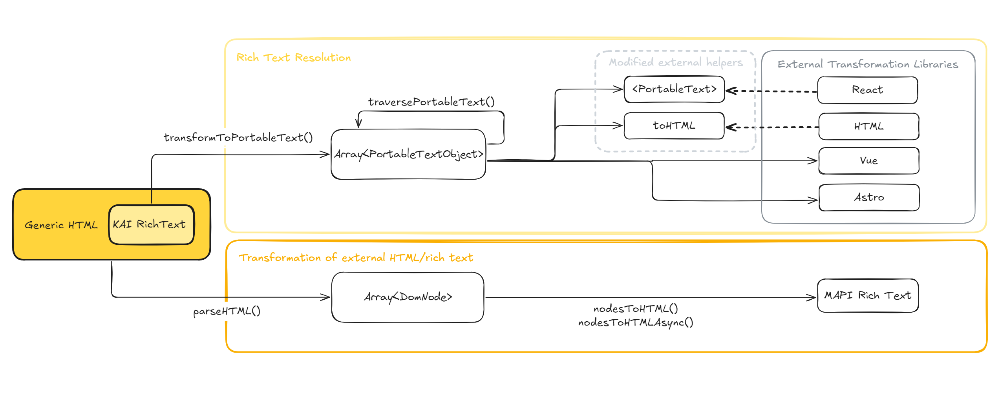

# Kontent.ai rich text resolver

![Last modified][last-commit]
[![Issues][issues-shield]][issues-url]
[![Contributors][contributors-shield]][contributors-url]
[![MIT License][license-shield]][license-url]
[![codecov][codecov-shield]][codecov-url]
[![Stack Overflow][stack-shield]](https://stackoverflow.com/tags/kontent-ai)
[![Discord][discord-shield]](https://discord.gg/SKCxwPtevJ)

This package provides utilities for transforming Kontent.ai rich text into structured formats suitable for resolution and rendering in various environments.

## Installation

Install the package via npm

`npm i @kontent-ai/rich-text-resolver`

---

## Features

### API Overview



### Parsing rich text HTML to an array of simplified nodes

The tool provides environment-aware (browser or Node.js) `parseHTML` function to transform HTML into an array of `DomNode` trees. Any valid HTML is parsed, including all attributes. Together with built-in transformation methods, this tool is a suitable option for processing HTML and rich text from external sources, to make it compatible with Kontent.ai rich text format. See dedicated [HTML transformer docs](docs/index.md) for further information.

### Portable text resolution

[Portable Text](https://github.com/portabletext/portabletext) is a universal standard for rich text representation, with tools available for its transformation and rendering in majority of popular frameworks and languages:

- React: [react-portabletext](https://github.com/portabletext/react-portabletext)
- HTML: [to-html](https://github.com/portabletext/to-html)
- Svelte: [svelte-portabletext](https://github.com/portabletext/svelte-portabletext)
- Vue: [vue-portabletext](https://github.com/portabletext/vue-portabletext)
- Astro: [astro-portabletext](https://github.com/theisel/astro-portabletext)

> [!TIP]
> This module re-exports modified `toHTML` function and `<PortableText>` component from `to-html` and `react-portabletext` packages respectively. These modified helpers provide default resolution for tags which are either unsupported or only partially supported in the original packages (`sub` and `sup` tags, images, tables and links).
>
> Make sure to use these re-exports if you want to take advantage of the default resolution. You can still provide your own custom resolutions for the above tags even when using these helpers. 

The tool provides `transformToPortableText` function to convert rich text content into an array of Portable Text blocks, with custom blocks defined for Kontent.ai-specific objects.

Combined with a suitable package for the framework of your choice, this makes for an optimal solution for resolving rich text.

> [!IMPORTANT]
> The provided Portable Text transformation functions expect a valid Kontent.ai rich text content, otherwise you risk errors or invalid blocks in the resulting array.

#### Custom portable text blocks

Besides default blocks for common elements, Portable Text supports custom blocks, which can represent other entities. Each custom block should extend `ArbitraryTypedObject` to ensure `_key` and `_type` properties are present. Key should be a unique identifier (e.g. guid), while type should indicate what the block represents. Value of `_type` property is used for mapping purposes in subsequent resolution.

**This package comes with built-in custom block definitions for representing Kontent.ai rich text entities:**

##### Component/linked item – **PortableTextComponentOrItem**

https://github.com/kontent-ai/rich-text-resolver-js/blob/c62306f8415a6d8fdcec1434ef7102deb80cec88/showcase/showcase.ts#L3-L12

##### Image – **PortableTextImage**

https://github.com/kontent-ai/rich-text-resolver-js/blob/c62306f8415a6d8fdcec1434ef7102deb80cec88/showcase/showcase.ts#L14-L24

##### Item link – **PortableTextItemLink**

https://github.com/kontent-ai/rich-text-resolver-js/blob/c62306f8415a6d8fdcec1434ef7102deb80cec88/showcase/showcase.ts#L26-L34

##### Table – **PortableTextTable**

https://github.com/kontent-ai/rich-text-resolver-js/blob/c62306f8415a6d8fdcec1434ef7102deb80cec88/showcase/showcase.ts#L36-L62

## Examples

### Plain HTML resolution

HTML resolution using a slightly modified version of `toHTML` function from `@portabletext/to-html` package.

```ts
import {
  transformToPortableText,
  resolveTable,
  resolveImage,
  PortableTextHtmlResolvers,
  toHTML
} from "@kontent-ai/rich-text-resolver";

const richTextValue = "<rich text html>";
const linkedItems = ["<array of linked items>"]; // e.g. from SDK
const portableText = transformToPortableText(richTextValue);

const resolvers: PortableTextHtmlResolvers = {
  components: {
    types: {
      image: ({ value }) => {
        // helper method for resolving images
        return resolveImage(value); 
      },
      componentOrItem: ({ value }) => {
        const linkedItem = linkedItems.find(
          (item) => item.system.codename === value.componentOrItem._ref
        );
        switch (linkedItem?.system.type) {
          case "component_type_codename": {
            return `<p>resolved value of text_element: ${linkedItem?.elements.text_element.value}</p>`;
          }
          default: {
            return `Resolver for type ${linkedItem?.system.type} not implemented.`;
          }
        };
      },
      table: ({ value }) => {
        // helper method for resolving tables
        const tableHtml = resolveTable(value, toHTML);
        return tableHtml;
      },
    },
    marks: {
      contentItemLink: ({ children, value }) => {
        return `<a href="https://website.com/${value.contentItemLink._ref}">${children}</a>`;
      },
      link: ({ children, value }) => {
        return `<a href=${value?.href} data-new-window=${value?.["data-new-window"]}>${children}</a>`;
      },
    },
  },
};

const resolvedHtml = toHTML(portableText, resolvers);
```

### React resolution

React, using a slightly modified version of `PortableText` component from `@portabletext/react` package.

```tsx
import {
  PortableTextReactResolvers,
  PortableText,
  TableComponent,
  ImageComponent,
} from "@kontent-ai/rich-text-resolver/utils/react";
import {
  transformToPortableText,
} from "@kontent-ai/rich-text-resolver";

// assumes richTextElement from SDK

const resolvers: PortableTextReactResolvers = {
  types: {
    componentOrItem: ({ value }) => {
      const item = richTextElement.linkedItems.find(item => item.system.codename === value?.componentOrItem._ref);
      return <div>{item?.elements.text_element.value}</div>;
    },
    // Image and Table components are used as a default fallback if a resolver isn't explicitly specified
    table: ({ value }) => <TableComponent {...value} />,
    image: ({ value }) => <ImageComponent {...value} />,
  },
  marks: {
    link: ({ value, children }) => {
      return (
        <a href={value?.href} rel={value?.rel} title={value?.title} data-new-window={value?.['data-new-window']}>
          {children}
        </a>
      )
    },
    contentItemLink: ({ value, children }) => {
      const item = richTextElement.linkedItems.find(item => item.system.id === value?.contentItemLink._ref);
      return (
        <a href={"https://website.xyz/" + item?.system.codename}>
          {children}
        </a>
      )
    }
  }
}

const MyComponent = ({ props }) => {
  // https://github.com/portabletext/react-portabletext#customizing-components
  const portableText = transformToPortableText(props.element.value);

  return (
    <PortableText value={portableText} components={resolvers} />
  );
};
```

### Vue resolution
Using `@portabletext/vue` package

```ts
<script setup>
import {
  PortableText,
  PortableTextComponentProps,
  PortableTextComponents,
  toPlainText,
} from "@portabletext/vue";
import {
  resolveTableVue as resolveTable,
  resolveImageVue as resolveImage,
  toVueImageDefault,
} from "@kontent-ai/rich-text-resolver";


const components: PortableTextComponents = {
  types: {
    image: ({ value }: PortableTextComponentProps<PortableTextImage>) =>
      resolveImage(value, h, toVueImageDefault),
    table: ({ value }: PortableTextComponentProps<PortableTextTable>) =>
      resolveTable(value, h, toPlainText),
  },
  // marks etc.
};
</script>

<template>
  <PortableText :value="props.value" :components="components" />
</template>
```

### Modifying portable text nodes

Package exports a `traversePortableText` method, which accepts an array of `PortableTextObject` and a callback function. The method recursively traverses all nodes and their subnodes, optionally modifying them with the provided callback:

```ts
    import {
      PortableTextObject,
      transformToPortableText,
      traversePortableText,
    } from "@kontent-ai/rich-text-resolver";

    const input = `<figure data-asset-id="guid" data-image-id="guid"></figure>`;

    // Adds height parameter to asset reference and changes _type.  
    const processBlocks = (block: PortableTextObject) => {
      if (block._type === "image") {
        const modifiedReference = {
          ...block.asset,
          height: 300
        }
  
        return {
          ...block,
          asset: modifiedReference,
          _type: "modifiedImage"
        }
      }

      // logic for modifying other object types...

        // return original block if no modifications required
        return block;
    }

    const portableText = transformToPortableText(input);
    const modifiedPortableText = traversePortableText(portableText, processBlocks);
```


### MAPI transformation

`toManagementApiFormat` is a custom transformation method built upon `toHTML` package, allowing you to restore portable text previously created from management API rich text back into MAPI supported format.

```ts
  const richTextContent =
    `<p>Here is an <a data-item-id="12345"><strong>internal link</strong></a> in some text.</p>`;

  const portableText = transformToPortableText(richTextContent);
  
  // your logic to modify the portable text

  const validManagementApiFormat = toManagementApiFormat(portableText);
```

> [!IMPORTANT]  
> MAPI transformation logic expects Portable Text that had been previously created from management API rich text and performs only minimal validation. It doesn't provide implicit transformation capabilities from other formats (such as delivery API).
>
> If you're interested in transforming external HTML or rich text to a MAPI compatible format, see [HTML transformer docs](docs/index.md) instead.

[last-commit]: https://img.shields.io/github/last-commit/kontent-ai/rich-text-resolver-js?style=for-the-badge
[contributors-shield]: https://img.shields.io/github/contributors/kontent-ai/rich-text-resolver-js?style=for-the-badge
[contributors-url]: https://github.com/kontent-ai/rich-text-resolver-js/graphs/contributors
[issues-shield]: https://img.shields.io/github/issues/kontent-ai/rich-text-resolver-js.svg?style=for-the-badge
[issues-url]: https://github.com/kontent-ai/rich-text-resolver-js/issues
[license-shield]: https://img.shields.io/github/license/kontent-ai/rich-text-resolver-js?label=license&style=for-the-badge
[license-url]: https://github.com/kontent-ai/rich-text-resolver-js/blob/main/LICENSE
[stack-shield]: https://img.shields.io/badge/Stack%20Overflow-ASK%20NOW-FE7A16.svg?logo=stackoverflow&logoColor=white&style=for-the-badge
[discord-shield]: https://img.shields.io/discord/821885171984891914?label=Discord&logo=Discord&logoColor=white&style=for-the-badge
[codecov-shield]: https://img.shields.io/codecov/c/github/kontent-ai/rich-text-resolver-js/main.svg?style=for-the-badge
[codecov-url]: https://app.codecov.io/github/kontent-ai/rich-text-resolver-js
