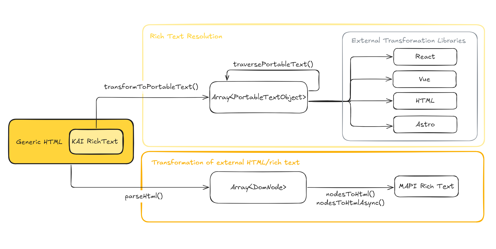

# Kontent.ai rich text resolver

[![MIT License][license-shield]][license-url]
[![Stack Overflow][stack-shield]](https://stackoverflow.com/tags/kontent-ai)
[![Discord][discord-shield]](https://discord.gg/SKCxwPtevJ)

A monorepo providing utilities for transforming Kontent.ai rich text into structured formats suitable for resolution and rendering in various environments.

## Packages

This monorepo contains the following packages:

| Package | Description |
|---------|-------------|
| [@kontent-ai/rich-text-resolver](./packages/rich-text-resolver) | Core parsing and portable text transformation |
| [@kontent-ai/rich-text-resolver-html](./packages/rich-text-resolver-html) | HTML resolution and MAPI transformation |
| [@kontent-ai/rich-text-resolver-react](./packages/rich-text-resolver-react) | React components and helpers |
| [@kontent-ai/rich-text-resolver-vue](./packages/rich-text-resolver-vue) | Vue composables and helpers |
| [@kontent-ai/rich-text-resolver-markdown](./packages/rich-text-resolver-markdown) | Markdown transformation utilities |

## Quick Start

1. **Install the core package** for portable text transformation:
   ```bash
   npm i --save @kontent-ai/rich-text-resolver
   ```

2. **Choose a resolution package** for your framework:
   ```bash
   # For HTML resolution
   npm i --save @kontent-ai/rich-text-resolver-html

   # For React
   npm i --save @kontent-ai/rich-text-resolver-react

   # For Vue
   npm i --save @kontent-ai/rich-text-resolver-vue

   # For Markdown
   npm i --save @kontent-ai/rich-text-resolver-markdown
   ```

3. **Transform and resolve** your rich text:
   ```ts
   import { transformToPortableText } from "@kontent-ai/rich-text-resolver";
   import { toHTML } from "@kontent-ai/rich-text-resolver-html";

   const richTextValue = "<your rich text html>";
   const portableText = transformToPortableText(richTextValue);
   const html = toHTML(portableText);
   ```

## Architecture Overview



The architecture follows a modular approach:

- **Core Package** (`@kontent-ai/rich-text-resolver`) - Provides the transformation engine that converts Kontent.ai rich text HTML into Portable Text format
- **Framework Packages** - Provide resolution tools for specific frameworks (React, Vue) or output formats (HTML, Markdown)

## Documentation

For detailed documentation and examples, see individual package READMEs:

- **[Core Package Documentation](./packages/rich-text-resolver/README.md)** - Parsing, transformation, and portable text utilities
- **[HTML Package Documentation](./packages/rich-text-resolver-html/README.md)** - HTML resolution and Management API transformation
- **[React Package Documentation](./packages/rich-text-resolver-react/README.md)** - React components and helpers
- **[Vue Package Documentation](./packages/rich-text-resolver-vue/README.md)** - Vue composables and helpers
- **[Markdown Package Documentation](./packages/rich-text-resolver-markdown/README.md)** - Markdown transformation utilities

## Contributing

### Development Setup

```bash
# Clone and install
git clone https://github.com/kontent-ai/rich-text-resolver-js.git
cd rich-text-resolver-js
pnpm install --frozen-lockfile

# Build all packages
pnpm build

# Run tests
pnpm test

# Check formatting and linting
pnpm biome:check
```

### Release Workflow

This repository uses [Changesets](https://github.com/changesets/changesets) for version management and publishing.

#### During Development

When making changes that affect users (features, fixes, breaking changes), add a changeset:

```bash
pnpm changeset add
```

Follow the interactive prompts to:
1. Select affected packages
2. Choose bump type (patch/minor/major)
3. Write a description of the change

Commit the generated changeset file with your code changes.

#### Stable Releases (Automated)

1. **Add changesets** during development
2. **Create PR** with your changes and changesets
3. **Merge to main** - Changesets Action automatically creates a "Version Packages" PR
4. **Review and merge** the Version Packages PR
5. **Automated publishing** - Packages are published to npm automatically

#### Prerelease/Beta Publishing (Manual)

For testing prereleases from a branch:

```bash
# Enter prerelease mode
pnpm changeset pre enter beta

# Update versions with beta tags
pnpm changeset:version

# Commit, build, and publish
git add . && git commit -m "Version packages for beta release"
pnpm build
pnpm changeset:publish
git push --follow-tags

# When done, exit prerelease mode
pnpm changeset pre exit
```

## Support

Found a bug or have a feature request? Please [open an issue](https://github.com/kontent-ai/rich-text-resolver-js/issues).

[license-shield]: https://img.shields.io/github/license/kontent-ai/rich-text-resolver-js?label=license&style=for-the-badge
[license-url]: https://github.com/kontent-ai/rich-text-resolver-js/blob/main/LICENSE
[stack-shield]: https://img.shields.io/badge/Stack%20Overflow-ASK%20NOW-FE7A16.svg?logo=stackoverflow&logoColor=white&style=for-the-badge
[discord-shield]: https://img.shields.io/discord/821885171984891914?label=Discord&logo=Discord&logoColor=white&style=for-the-badge

