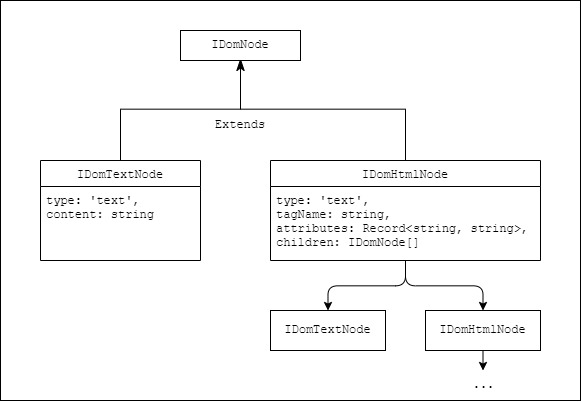

# TypeScript rich text parser for Kontent.ai

This tool provides an alternative to rich text parsing and resolution built into the JS SDK, allowing more control over the resolution process, such as specifying the output type and structure.

## Installation

Install the package via npm

```npm i @pokornyd/kontent-ai-rich-text-parser```

***

## Usage

Module provides two classes to parse rich text HTML into a simplified JSON tree: ```RichTextBrowserParser``` for client-side resolution and ```RichTextNodeParser``` for server-side use with Node.js.

Both classes are initialized with empty constructor and their use is identical, only difference is the underlying parsing logic. Each exposes a single ```parse``` method, which accepts rich text HTML value in string format.

```ts
const parser = new RichTextBrowserParser(); // RichTextNodeParser();

const parsedTree = parser.parse(richTextValue);
```

Result is a simple tree structure, defined by the following interface:

```ts
interface IOutputResult {
    childNodes: IDomNode[]
}
```

``IDomNode`` is further extended by ``IDomHtmlNode`` and ``IDomTextNode``, which together define the full HTML tree structure:



### Resolution

Resolution is achieved by traversing the output tree returned from ```parse``` method and manipulating it as per contextual requirements. 

To identify each node, you may use helper methods included in the module (``isText``, ``isElement``, ``isLinkedItem``, ``isImage``, ``isItemLink``, ``isUnpairedElement``) as in the below example, or manually, based on the domNode type and attributes. See example usage below:

**HTML string (TypeScript)**
```ts
const parsedTree = new RichTextBrowserParser().parse(richTextValue);

const resolve = (domNode: IDomNode): string => {
    switch (node.type) {
        case 'tag': {
            if(isLinkedItem(node))
                return resolveLinkedItem(node);
            else if(isImage(node))
                return resolveImage(node);
            else if(isItemLink(node))
                return resolveItemLink(node);
            else
                return resolveHtmlElement(node);
            break;
        }

        case 'text':
            return node.content                   
    
        default:
            throw new Error("Invalid input.");
    }
}

renderResolvedRichText(resolve);
```

**React with context object containing the rich text objects for resolution**

```ts
// assumes element prop comes from JS SDK

const RichText: React.FC<RichTextProps> = (props) => {
  const [richTextContent, setRichTextContent] = useState<JSX.Element[] | null>(null);
  const context: IResolutionContext = {
    images: Object.fromEntries(props.element.images.map(image => [image.imageId, {
        image_id: image.imageId,
        description: image.description,
        url: image.url,
        width: image.width || null,
        height: image.height || null
    }])),
    links: Object.fromEntries(props.element.links.map(link => [link.linkId, {
        codename: link.codename,
        type: link.type,
        url_slug: link.urlSlug
    }])),
    modularContent: props.element.linkedItemCodenames,
    linkedItems: props.element.linkedItems
  })

  useEffect(() => {
    const parsedTree = new RichTextNodeParser().parse(richTextValue);
    const resolve = (domNode: IDomNode, context: IResolutionContext, index: number): JSX.Element => {
        if (isElement(node)) {
            const childElements = domNode.children.map(node => resolve(node));

            if (isUnpairedElement(node)) {
                const element = React.createElement(domNode.tagName, {...domNode.attributes});
            }

            if (isLinkedItem(node)) {
                const itemCodeName = domNode.attributes['data-codename'];
                const linkedItem = context.linkedItems.find(item => item.system.codename === itemCodeName);

                switch (linkedItem?.system.type) {
                    case 'youtube_video': {
                        return <YoutubeVideo key={index} id={linkedItem.elements.videoId.value} />;
                    }
                    default: {
                        return <div key={index}>Failed resolving item {linkedItem.system.codename}. Resolver for type {linkedItem.system.type} not implemented.</div>;
                    }
                }
            }
            
            const attributes = { ...domNode.attributes, key: index };
            const element = React.createElement(domNode.tagName, attributes, childElements);

            return element;
        }


        if (isText(node)) {
            return <React.Fragment key={index}>{domNode.content}</React.Fragment>
        }

        throw new Error("Undefined state");
    }

    const result = parsedTree.childNodes.map((node, index) => resolve(node, context, index));
    setRichTextContent(result);
  }, [props.element]);

  return (
    <div className={props.className}>
      {richTextContent}
    </div>
  );
};
```


